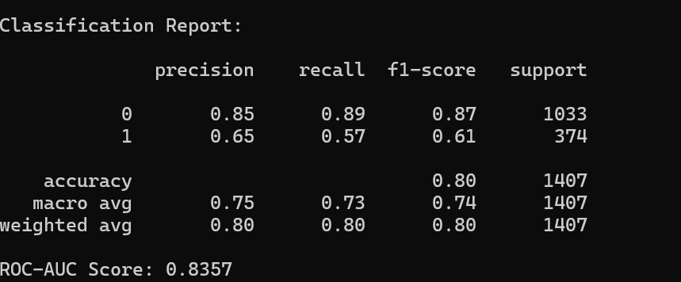
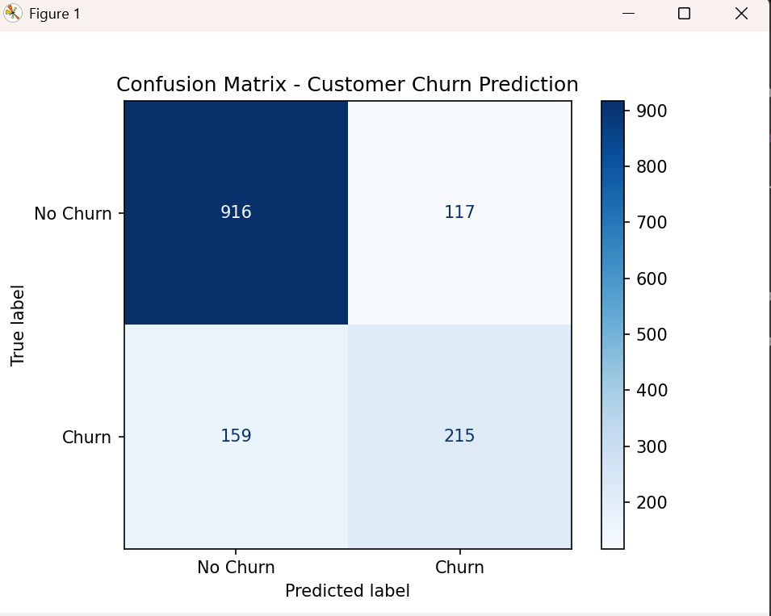
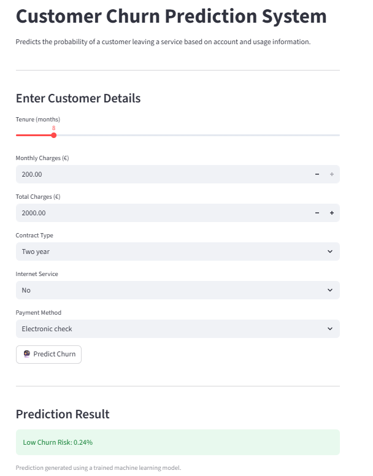

# End-to-End Customer Churn Prediction System
## Overview

Customer churn is a critical challenge for subscription-based businesses, directly impacting revenue and long-term growth.
This project presents a production-ready, end-to-end machine learning system that predicts customer churn using structured customer data and deploys the trained model as an interactive web application.

The project demonstrates industry-standard machine learning engineering practices, including data preprocessing, model selection, evaluation, explainability, and deployment.

## Problem Statement

Predict whether a customer is likely to churn (leave the service) based on historical customer demographics, service usage, and the billing information.

### Business Objective:
Enable proactive customer retention by identifying high-risk customers early.

## Solution Approach

The system follows a complete machine learning lifecycle:
- Data ingestion and cleaning
- Feature encoding and engineering
- Model training and comparison
- Model evaluation using appropriate metrics
- Model explainability
- Deployment for real-time inference


## Dataset

- Dataset: Telco Customer Churn Dataset
- Type: Structured tabular data
- Target Variable: Churn (Yes / No)
- Challenge: Class imbalance (more non-churn than churn customers)

## Models Used

Multiple classification models were trained and evaluated:
- Logistic Regression:-	Baseline & interpretable model
- Random Forest:- Non-linear ensemble comparison
#### Final Model Selection

Logistic Regression was selected based on:
- Highest ROC-AUC score
- Model stability

Interpretability (important for business & regulatory use)

## Model Performance
- Primary Metric: ROC-AUC
- Secondary Metrics: Precision, Recall, F1-Score, Confusion Matrix

Metric	Value:
- ROC-AUC	~0.84
- Accuracy	~0.80
- Churn Recall	~0.57

These results indicate strong discriminative ability on an imbalanced dataset.

## Model Explainability

To ensure transparency and trust, model explainability was incorporated using Logistic Regression coefficients.

Key benefits:
- Identification of major churn drivers
- Business-interpretable insights
- Alignment with explainable AI practices

Top influencing features include:
- Contract type
- Customer tenure
- Monthly charges
- Payment method

## Deployment

The trained model is deployed using Streamlit, enabling real-time churn probability predictions from user inputs.

Features:
- Human-readable inputs
- Probability-based output
- Robust feature alignment
- Production-safe inference logic

### How to Run the Project
```md
1️. Clone the Repository
     git clone <repository-url>
     cd End-to-End-Customer-Churn-Prediction-System

2️. Create Virtual Environment (Recommended)
     python -m venv venv
     source venv/bin/activate      # Linux / macOS
     venv\Scripts\activate         # Windows

3️. Install Dependencies
     pip install -r requirements.txt

4️. Train the Model
     python src/train.py

5️. Evaluate the Model
     python src/evaluate.py
```
<p align="center">
  
</p>

<p align="center">
  
</p>

```md
6️. Run the Web Application
     streamlit run app.py

7. Then Open in browser:
     http://localhost:8501

```
<p align="center">
  
</p>

## Technologies Used
- Python
- Pandas, NumPy
- Scikit-Learn
- Matplotlib
- Streamlit
- Joblib

## Key Highlights (Recruiter View)

- End-to-end ML pipeline
- Proper model evaluation on imbalanced data
- Explainable machine learning
- Deployment-ready architecture
- Clean, modular, reproducible code
- Business-focused problem solving

## Future Improvements
- Probability calibration (Platt / Isotonic)
- SHAP-based explainability
- Dockerized deployment
- CI/CD pipeline for retraining

## Author

Sajan Sah
B.Tech in Computer Science & Engineering  
Minor in Applied Machine Learning